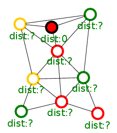

# Maximum Leaf Spanning Tree

## Setting

* A lot of nodes that sense some data and send it to a central server
* There may be no direct connection to the server, thus we need a multiple hop communication tree.
* The nodes that may forward messages (non-leaves in the tree) are called the backbone
* The highest energy consumption of the nodes is due to staying online (but there is only low utilization)
* Data has to be sent to the server in time

## Motivation

* Leaf-Nodes that are not used to forward messages can go offline if they have no data to send.
* Maximizing the amount of leaves is advantageous to minimize the overall energy consumption.
* This problem is known as the Maximum Leaf Spanning Tree (NP-Complete due to equivalence to Maximum Connected Dominating Set [Paper](http://www.sciencedirect.com/science/article/pii/0012365X92901308))

### Example

We have the following communication graph:

Only the red nodes need to stay online to ensure immediate communication possibility

## Previous Work

We are only interested in self-stabilizing distributed algorithms. 
There are three such algorithms known to us:

* A self-stabilizing 3-approximation for the maximum leaf spanning tree problem in arbitrary networks (Kamei et al., 2011) [PDF](http://link.springer.com/article/10.1007/s10878-011-9383-5#page-1)
* Distributed Algorithm for Constructing Efficient Tree Topology for Message Dissemination in Vehicular Networks (Kamakshi and Natarajan,2014) [PDF](http://www.hindawi.com/journals/ijvt/2014/903895/)
* Maximum-Leaf Spanning Trees for Efficient Multi-Robot Recovery with Connectivity Guarantees (Habibi and McLurkin, 2014) [PDF](http://mrsl.rice.edu/papers/maximum-leaf-spanning-trees-efficient-multi-robot-recovery-connectivity-guarantees)

In our opinion, the third one is the most dynamic and robust.
It starts on the BFS-Tree that can be very robust implemented while the other ones build forests that are later merged.

### Algorithm of Habibi and McLurkin

Note: For the implementation we need public variables that are explained later. If you do not know public variables, read that section first.

The general idea is to take a look on the BFS.
The BFS can be simply implemented by a single public variable *d*: If sink, d=0. Otherwise d=min{n.d+1 | n in Neighorhood}.
This gives us a set of potential parents (those neighbors n with n.d = d+1).
From this set chose the parent with the maximal amount of children.

There are some details that have to be taken care of like: 

* How to determine the amount of children?
* How to handle undefined variables?
* How to decide on ambiguity? (simply choosing the one with lower ID is not the best choice)

However, for these details we refer to the original paper.

## Experiments

To evaluate the applicability and performance of the algorithm, experiments in a simulator ([Platypus300](https://github.com/SwarmRoboticResearch/platypus3000)).

* n Robots with range *1.8m* and radius *10cm* are placed randomly in a *sqrt(n) x sqrt(n)* square
* On average there are around 66\% leaves

## Public Variables

Public Variables are a robust concept for distributed algorithm that are close to the mathematical description.
E.g. Let's build a routing tree, i.e., every node knows how far it is from the root.
Obviously the root itself knows it has distance 0, the other nodes know that they have the minimal distance of their neighbors plus their distance to this neighbor (assumed to be 1).
Thus we obtain dist = min{n.dist+1 | n in Neighorhood}

The implementation of the algorithm consists of two parts:

1. Define a public variable and init PVN

	struct distancePubVar { // The public variable
	uint16_t distance ;
	};
	struct distancePubVar own_pv ; // own instance of the PV
	struct PVN pvn ; // The public variable neighborhood
	own_pv . distance = 0 xffff ; // Set distance to maximal
	pvn_init (& pvn , 123 , // Port
		& own_pv , sizeof ( own_pv ) , // own PV
		10 // Maximal age of neighbor entry
		);

2. Loop (actual algorithm)
	
	while (1){
		pvn_remove_old_neighbr_information(&pvn);
		own_pv . distance = 0 xffff ; // Set distance to maximal
		// Iterating neighbors
		struct Nbr * nbr = pvn_getNbrs (& pvn );
		for (; nbr !=0; nbr = pvn_getNextNbr ( nbr )){
			struct distancePubVar * n_pv =
			( struct distancePubVar*)( nbr ->public_var );
			if ( n_pv -> distance +1 < own_pv . distance )
				own_pv . distance = n_pv - > distance +1;
		}
		pvn_broadcast(&pvn); // broadcast new state
		SLEEP_PERIOD;
	}

## Going Offline
	
	TODO

## Energy Awareness

We may rather want one node with low battery to be leaf instead of two with high battery.
Let us assume we can robustly classify a node into a discrete level of battery states, let's say LOW=3, MIDDLE=2, and HIGH=1.
Robust means, that the values are rather stable and do not fluctuate.

We propose three different algorithms:

### 1. Algorithm
From the potential parents of the BFS, choose the one with the lowest battery state (HIGH=1, LOW=3).
If ambiguous, chose the one with the highest children count as the original algorithm.

### 2. Algorithm
Build for each energy state a tree that is only allowed to use nodes as parents that have this or a better battery state.
On the resulting trees apply the origin algorithm.
Obviously, not all nodes may be in every tree (but a least in the LOW-Tree).
Choose as parent the defined parent of the tree with lowest state (thus prefers parent of HIGH=3-Tree over LOW=1-Tree)

This algorithm always finds a tree that uses no LOW-Nodes or no MIDDLE/LOW-Nodes if such trees exist.

### 3. Algorithm
The BFS-Tree can be seen as the routing tree for all edges with weight 1.
If we now give the edges to the parent the weight of the energy state of the parent, we result in a different tree (but that is still robust).
On this tree we simply apply the origin algorithm.
The potential parents are those with a lower value.

This algorithm can be tuned by changing the weights.

### Experiments

The data for 8 random instances with 90 nodes as in the experiments above.
There are 30 nodes of each battery class: LOW, MIDDLE, HIGH.
Entries are in the form (\#HIGH,\#MIDDLE,\#LOW)[\#ALL], where each # refers to the number of leaves in the set.

Instance 	| 	Origin 					| 	EA-Algorithm 1 			| EA-Algorithm 2 			| 	EA-Algorithm 3
------------|:-------------------------:|:-------------------------:|:-------------------------:|:-------------------------:|
1			| (21, 18, 20)\[59\] 		| (16, 17, 26)\[59\] 		| (16, 19, 29)\[64\] 		| (15, 18, 26)\[59\]
2			| (21, 18, 24)\[63\] 		| (15, 19, 25)\[59\]		| (16, 20, 30)\[66\]		| (15, 20, 28)\[63\]
3			| (17, 22, 20)\[59\] 		| (13, 23, 23)\[59\]		| (16, 23, 30)\[69\]		| (13, 24, 24)\[61\]
4			| (18, 22, 22)\[62\]		| (14, 22, 24)\[60\]		| (15, 22, 27)\[64\]		| (16, 23, 25)\[64\]
5			| (17, 22, 17)\[56\] 		| (10, 21, 22)\[53\]		| (10, 23, 28)\[61\]		| (9, 23, 24)\[56\]
6			| (18, 18, 23)\[59\] 		| (13, 22, 27)\[62\]		| (13, 22, 30)\[65\]		| (12, 22, 27)\[61\]
7			| (18, 24, 20)\[62\]		| (13, 25, 23)\[61\]		| (14, 25, 27)\[66\]		| (15, 23, 23)\[61\]
8			| (18, 21, 21)\[60\] 		| (13, 22, 24)\[59\]		| (13, 22, 30)\[65\]		| (12, 23, 25)\[60\]
9			| (19, 21, 15)\[55\]		| (13, 24, 20)\[57\] 		| (14, 23, 30)\[67\]		| (15, 24, 24)\[63\]
10			| (21, 20, 19)\[60\] 		| (14, 20, 22)\[56\] 		| (12, 20, 28)\[60\]		| (12, 22, 26)\[60\]
AVG:		| (18.8, 20.6, 20.1)\[59.5\]| (13.4, 21.5, 23.6)\[58.5\]| (13.9, 21.9, 28.9)\[64.7\]| (13.4, 22.2, 25.2)\[60.8\]

As can bee seen, the EA-Algorithm 2 performs best. For some reason, it even yields more leaves than the origin algorithm.
The EA-Algorithm 3 performs good too but is more flexible than EA-Algorithm 2.
The EA-Algorithm 1 has been beaten in all categories by the other two algorithms, but it is more energy aware than the origin algorithm.
